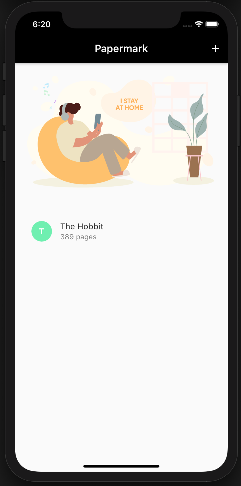
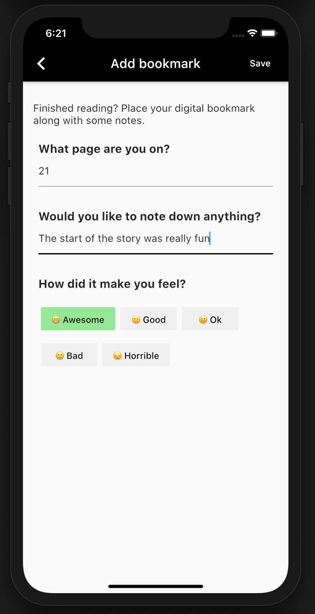
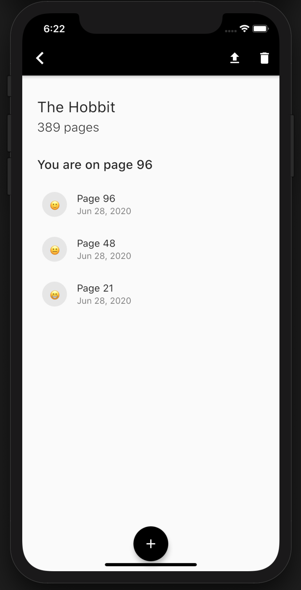

# Papermark Flutter App 🚀

Papermark app, a Flutter (Android and iOS) project. Submitted to [Flutter Hack20 hackathon](https://flutterhackathon.com/#/).

 

## About 💡

Topic: Saving the Planet (Eco/What we've learned during the pandemic)

Staying home saves lives. Papermark is a Flutter app that inspires everyone to read and connect with their friends during this pandemic.

 

## Motivation 💭

The pandemic has changed our lives. For most people, this meant working or spending most of their time at home. The motivation behind Papermark was inspired by a book club that I started with my friend to help us keep motivated and engaged in activities that we both enjoyed. The use of Flutter helped me create beautiful mobile-friendly UIs in a short period of time that I can publish. I have implemented the ability to save data using SQLite and share content with my friends using share package.

 

## Demo 📱
### Video

 

### Screenshots

 

 

 

## How it works 🏗️
Launch the application and start by adding your first book. To add a new book, simply provide the title of the book as well as how many pages it contains. Once added, that book will be shown on the main book list. The application makes use of SQL Lite, which means that data is securely saved on your device only.

Suppose you have completed a reading, you can log your progress within this application. Click on the book once the application is open and click on the + icon. Add which page you left off at, any personal notes regarding your reading and how did it make you feel. Once added, it will be part of your progress list. Now you can track your progress of all of your readings.

 

## Technologies 📦

This would not be possible without these fantastic Flutter packages:
- [sqflite](https://pub.dev/packages/sqflite)
- [lottie](https://pub.dev/packages/lottie)
- [intl](https://pub.dev/packages/intl)
- [share](https://pub.dev/packages/share)

 

## Additional Information 📚
All images in the projects are free to use. Feel free to `git clone` the project and try it out for yourself. Please let me know if you have any questions, concerns or feedback. You can reach out to me at [@asadmansr](https://twitter.com/asadmansr)
